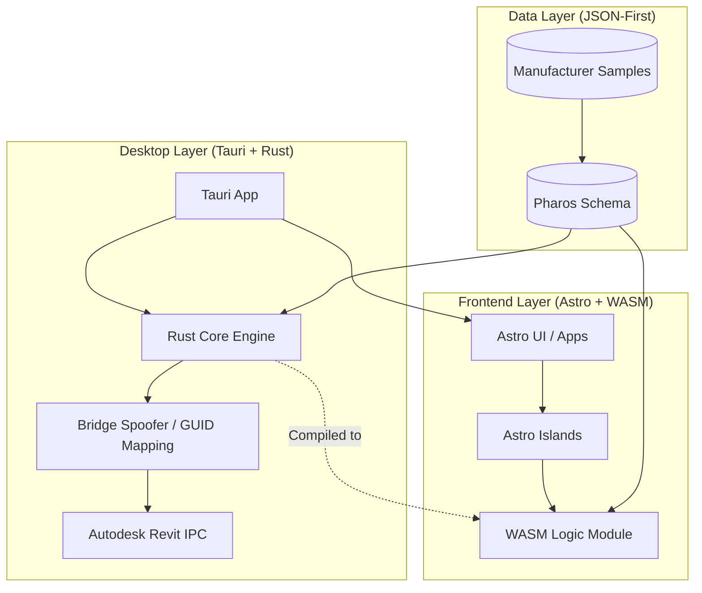
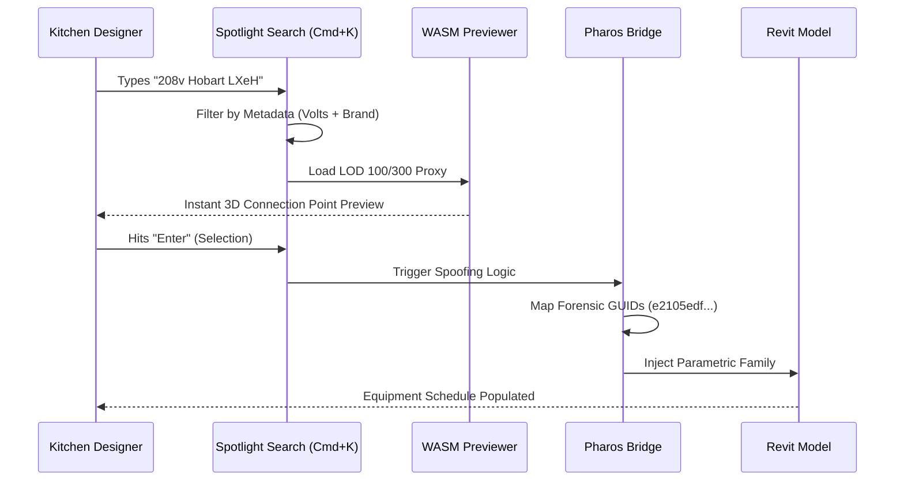
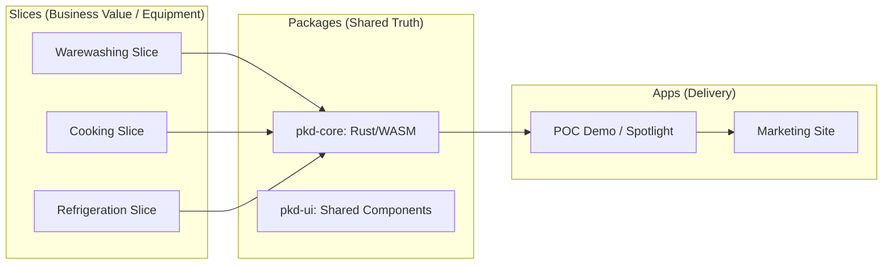
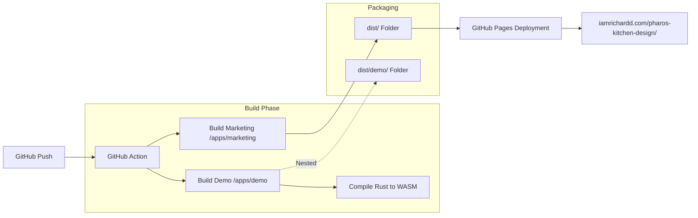

/* ========================================================================
 * Project: Pharos Kitchen Design (Project Prism)
 * Component: Documentation
 * File: ARCHITECTURE.md
 * Author: Richard D. (https://github.com/iamrichardd)
 * Purpose: Mermaid visualizations for Human-AI contextual alignment.
 * Traceability: UX/VSA Strategy Approved 2026-03-31
 * ======================================================================== */

# Pharos Architectural & UX Visualizations

## 1. System Hierarchy (The Ultimate Stack)
Illustrates the interaction between the Desktop wrapper, the Web frontend, and the high-performance Rust/WASM core.

## 2. Command-First UX Workflow (IKD Empowerment)
Visualizes the "Hybrid Spotlight" interaction designed to eliminate search-and-click toil for Independent Kitchen Designers.

## 3. Vertical Slice Architecture (VSA) Map
The monorepo is organized by **Business Value (Equipment Category)** rather than technical layers.

## 4. Deployment Pipeline (Nested Monorepo Build)
Illustrates the CI/CD flow for deploying the unified monorepo to GitHub Pages.

## 5. Fail Fast Engineering (The Sentinel Strategy)
Pharos implements a "Fail Fast" strategy to eliminate the "Hallucination Gap" and reduce debugging toil.

*   **System Seams:** Invariants are checked at every system boundary (CLI-to-Bridge, Bridge-to-Cognito, Core-to-Revit).
*   **Informative Failure:** Errors MUST include specific context (e.g., specific missing field names or file paths) to ensure 30-second root-cause identification.
*   **No Masking:** The system is prohibited from "failing slowly" through default values or `null` workarounds for critical data.

---
### Legal & Interoperability Compliance
**Pharos Kitchen Design** (Project Prism) is an independent software development effort. Use of any third-party trademarks (e.g., KCL, AutoQuotes, Hobart, Vulcan) is strictly for **Nominative Fair Use** to identify compatibility and achieve software interoperability under **17 U.S.C. § 1201(f)**. Please see [DISCLAIMER.md](../DISCLAIMER.md) for full legal disclosures.
