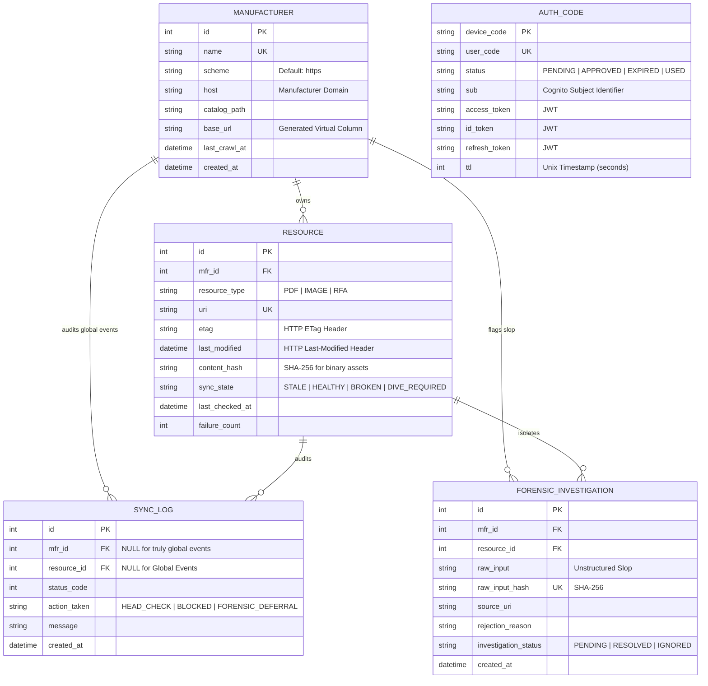

<!-- ========================================================================
 * Project: Pharos Kitchen Design (Project Prism)
 * Component: Documentation / Schema
 * File: SCHEMA.md
 * Author: Richard D. (https://github.com/iamrichardd)
 * License: FSL-1.1 (See LICENSE file for details)
 * Purpose: Unified Entity Relationship Diagram and Schema Specification.
 * Traceability: ADR-0015, ADR-0017, Issue #47
 * ======================================================================== -->

# 🗺️ Pharos Entity Relationship Diagram (ERD)

This document serves as the **Unified Source of Truth** for the Pharos Kitchen Design monorepo. It bridges the gap between the **Truth Engine (SQLite)** and the **Auth-Bridge (Cloudflare D1)**.

## 1. System Visualization

## 2. Implementation Mandates

### Type Invariants
*   **Timestamps**: All temporal fields MUST use `DATETIME` or `TIMESTAMP` formats. Raw strings (e.g., "today") are strictly prohibited in production tables.
*   **Hashes**: Content and raw input hashes MUST use **SHA-256** to ensure collision resistance and deterministic deduplication.
*   **Enums**: While SQLite does not support native Enums, implementation logic (e.g., `TruthEngine`) MUST enforce strict validation against the documented states.

### Security Boundaries
*   **SSRF Domain Sentinel**: The `RESOURCE.uri` must be validated against the `MANUFACTURER.host` before registration.
*   **Token Isolation**: `AUTH_CODE` tokens are transient and intended for initial device registration. Long-term storage of these tokens requires field-level encryption (Future ADR).
