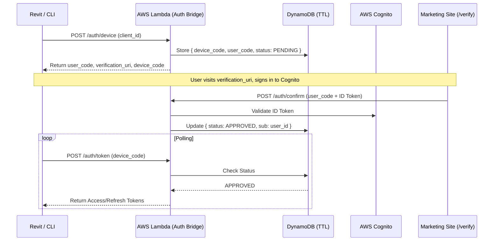

/* ========================================================================
 * Project: Pharos Kitchen Design (Project Prism)
 * Component: Documentation / Security
 * File: 0018-identity-and-authentication-architecture.md
 * Status: Approved
 * Author: Richard D. (https://github.com/iamrichardd)
 * License: FSL-1.1 (See LICENSE file for details)
 * Purpose: Defining the cross-platform identity model (Web, Revit, CLI).
 * Traceability: ADR 0005, ADR 0016, RFC 8628, ADR 0019
 * ======================================================================== */

# ADR 0018: Identity & Authentication Architecture

## Context
Pharos Kitchen Design (PKD) requires a unified identity model to manage manufacturer "Hero" metadata and IKD (Independent Kitchen Designer) sessions. Standard web-based OIDC (OpenID Connect) flows fail to address the **Revit Desktop** and **CLI** environments, creating a "Web-Desktop Gap." We must ensure that authentication is high-performance, legally defensive (FSL-1.1), and eliminates "Credential Toil."

## Decision
1. **RFC 8628 (Device Authorization Grant)**: Standardize on the "Device Code" pattern for all non-browser environments (Revit Plugin, CLI).
2. **Identity Provider (IdP)**: **AWS Cognito** (User Pool) for core identity storage, leveraging the AWS Free Tier.
3. **Bridge Logic**: **AWS Lambda + Amazon DynamoDB** to implement the missing RFC 8628 support in Cognito.
4. **Mermaid-First Handshake**:

## PII & Privacy (Shift-Left Security)

To comply with **ADR-0016 (Shift-Left Security)** and global privacy standards (GDPR/CCPA), Pharos Kitchen Design adopts a "Siloed Identity" model:

1. **Cognito as PII Vault**: All Personally Identifiable Information (Email, Hashed Passwords) is stored exclusively in AWS Cognito.
2. **Opaque Identifiers (UUIDs)**: The system utilizes the Cognito `sub` (UUID) as the primary "Foreign Key" for all internal and external data relationships.
3. **Anonymized Handshakes**: The **Auth Bridge** (ADR-0019) never stores PII. It only maps ephemeral codes to the opaque UUID (`sub`).
4. **Attribution vs. Identity**: BIM metadata refers to the `author_id` (UUID). Resolution of this ID to a human-readable name is a privileged operation performed at the API layer.

## Web Hosting & WASM Compatibility

To minimize infrastructure overhead and maintain our "Bootstrap" posture, the web application will utilize a **"Heavy Client / Lean Backend"** model:

1. **Hosting**: The primary UI (Marketing & Designer Portal) remains hosted on **GitHub Pages** as a static Astro build.
2. **Custom Auth UI**: Pharos will NOT use the Cognito Hosted UI. Instead, a custom, high-fidelity authentication interface will be built within the Astro application using the **AWS Amplify Auth SDK**, ensuring a seamless "Command-First" brand experience.
3. **WASM-First Logic**: All core BIM processing and metadata normalization occur in the client's **WebAssembly (WASM)** environment.
4. **Desktop Security (keyring-rs)**: For Revit and CLI environments, access and refresh tokens will be stored exclusively in OS-native vaults (Windows Credential Manager / macOS Keychain) using the **`keyring-rs`** crate.

## Rationale
Building a custom UI eliminates the "AWS Context Switch," maintaining the high-rigor aesthetic required for Project Prism. Leveraging `keyring-rs` ensures that we never store sensitive tokens in plain text on the designer's filesystem, adhering to **ADR-0016 (Shift-Left Security)**.

## Security Review Threshold (Human Sign-off Required)
- [x] Choice of final Identity Provider: **AWS Cognito + Lambda Bridge**.
- [x] Custom Auth UI (Astro + Amplify SDK).
- [x] OS-native vault library: **keyring-rs**.
- [ ] Token expiration and rotation policy (Proposed: 1hr Access, 30-day Refresh).
