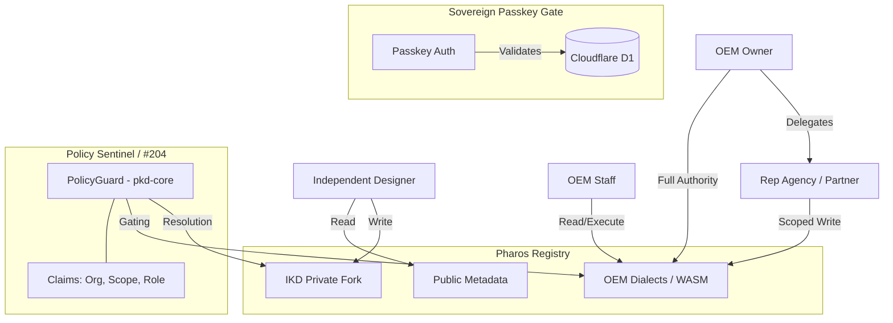

<!-- ========================================================================
 * Project: Pharos Kitchen Design (Project Prism)
 * Component: Documentation / Strategy
 * File: docs/adr/0056-sovereign-authority-and-delegate-enforcement.md
 * Author: Richard D. (https://github.com/iamrichardd)
 * License: FSL-1.1 (See LICENSE file for details)
 * Purpose: Codifying the Sovereign Identity transition and the "Informed Sentinel" logic.
 * Traceability: Issue #204, ADR-0018, ADR-0027, ADR-0049, ADR-0050
 * Status: Proposed
 * ======================================================================== -->

# ADR 0056: Sovereign Authority & Delegate Enforcement

## Context
Pharos Kitchen Design (Project Prism) has successfully migrated its identity model from AWS Cognito to a **Sovereign Passkey (D1-backed)** architecture (ADR-0049, ADR-0050). However, legacy documentation (ADR-0018, ADR-0027) remains anchored to AWS-specific claims and logic. 

As we implement **Issue #204 (Multi-Org Pulse Filtering)**, we must formalize the "Informed Sentinel" logic—a high-rigor enforcement layer that prioritizes local autonomy (IKD Forks) and cryptographic proof of authority over simple string mapping.

## Decision
1. **Supersede Legacy Documentation**: This ADR officially supersedes **ADR-0018** (Identity Architecture) and **ADR-0027** (Org Scopes). All references to AWS Cognito, DynamoDB, and `custom:claims` are hereby decommissioned.
2. **The "Sovereign Claims" DTO**: Authority is now derived from a D1-backed session object.
    - **`organization_id`**: The proven entity ID (e.g., `HOBART`).
    - **`scope_set`**: A cryptographic capability set (e.g., `oem.write`, `maintenance.execute`).
    - **`identity_thumbprint`**: The public key thumbprint of the user's Passkey.
3. **The "Informed Sentinel" Logic (Issue #204)**:
    - **Local Priority (The Fork)**: The `PolicyGuard` in `pkd-core` MUST prioritize the `IKD_PRIVATE_FORK` over the `OFFICIAL_OEM_DATA` in the local registry context.
    - **Resolution Hints**: Denials are no longer silent. The Sentinel MUST return a `ResolutionHint` DTO to the UI, explaining the restriction and the strategy for access (e.g., "Verification Required").
4. **Delegate Enforcement Handshake**: 
    - Delegation between a Manufacturer and a Rep Agency is a **Biometric Handshake**. 
    - The Manufacturer grants a `ScopedCapability` which is signed by their Passkey and stored in D1. 
    - The Rep Agency "claims" this capability by proving their identity via their own Passkey.
5. **Architectural Topology**:

## Rationale
- **High Rigor**: Moving from strings to cryptographic proofs eliminates "Claim Spoofing."
- **Autonomy**: Prioritizing IKD Forks ensures the "Sanctuary" (ADR-0015) remains authoritative for the designer's workflow.
- **Transparency**: "Resolution Hints" eliminate the "Black Box" security feel, aligning with **ADR-0048 (Human-Centric Communication)**.
- **Lean Core**: Separating Identity (AuthN) from Authority (AuthZ) allows the `pkd-core` to remain lean and performant.

## Impact
- **Docs**: ADR-0018 and ADR-0027 marked as `Superseded`.
- **Packages**: `pkd-cli` and `auth-bridge` MUST be purged of AWS SDK dependencies.
- **Engine**: `pkd-core` will implement the `PolicyGuard` trait with resolution logic.

## Verification
- **Audit**: All AWS references in the codebase must be remediated.
- **TDD**: Implement `test_should_prioritize_fork_over_public` in the `PolicyGuard` test suite.
- **Handshake Verification**: Perform a simulated "Manufacturer to Rep" delegation and verify the signature in Podman.
