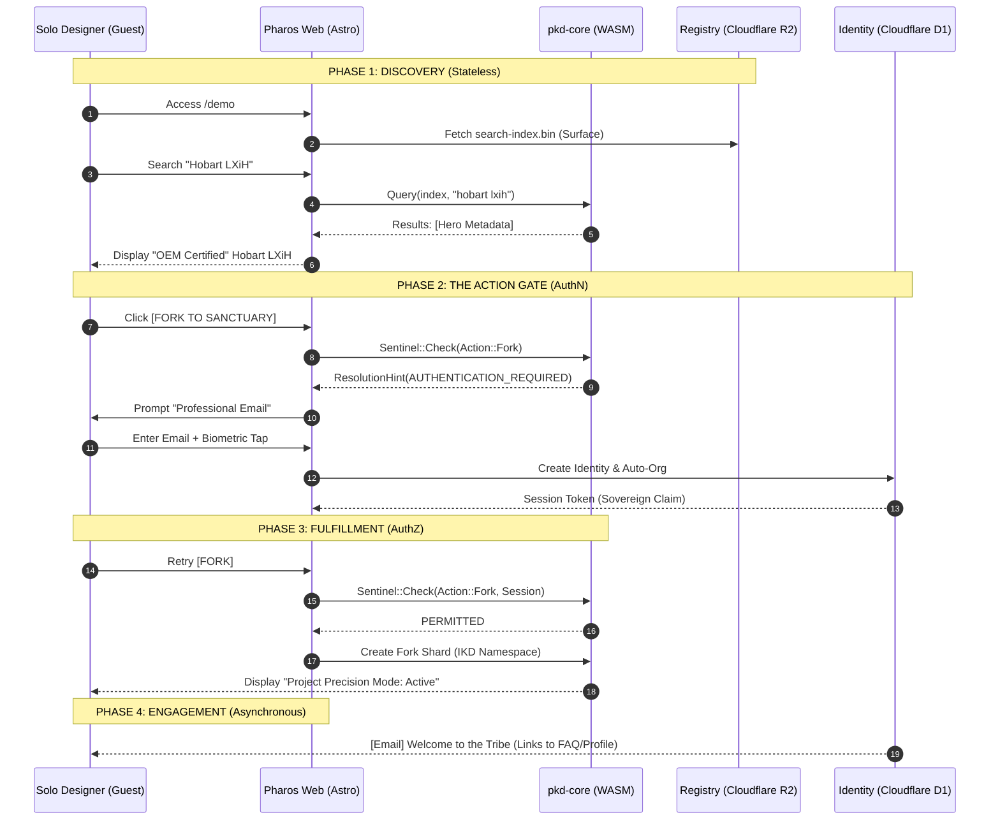

<!-- ========================================================================
 * Project: Pharos Kitchen Design (Project Prism)
 * Component: Documentation / Strategy
 * File: docs/adr/0060-interaction-model-framework.md
 * Author: Richard D. (https://github.com/iamrichardd)
 * License: FSL-1.1 (See LICENSE file for details)
 * Purpose: Codifying the framework for actor-specific interaction models.
 * Traceability: ADR-0056, ADR-0057, ADR-0058, ADR-0059
 * Status: Proposed
 * ======================================================================== -->

# ADR 0060: Interaction Model Framework

## Context
Pharos Kitchen Design (Project Prism) serves diverse actors (Solo Designers, Manufacturers, Rep Agencies) with varying security and utility requirements. To maintain architectural consistency across the Web, CLI, and Revit, we need a **Framework for Interaction Models**. This ADR defines the universal lifecycle phases and provides the **Solo Designer Interaction Model** as the primary reference implementation.

## Decision
We are adopting a **Universal 4-Phase Interaction Lifecycle**. All future specialized interaction models (OEM, Partner, Enterprise) MUST map their sequences to these four phases:

1.  **Phase 1: Discovery (Stateless)**:
    - Zero-friction entry. High-bandwidth artifact discovery.
    - **Policy**: Public Search Index (ADR-0057).
2.  **Phase 2: The Action Gate (Handshake)**:
    - The biometric seam between anonymity and authority.
    - **Policy**: Sovereign Passkey Registration/Auth (ADR-0050, ADR-0056).
3.  **Phase 3: Fulfillment (Authority)**:
    - High-value utility and data persistence.
    - **Policy**: Informed Sentinel & Local Sanctuary (ADR-0056, ADR-0059).
4.  **Phase 4: Maturation (Engagement)**:
    - Asynchronous relationship building and capability expansion.
    - **Policy**: Progressive Identity Maturation (ADR-0058).

### Reference Implementation: Solo Designer Flow
The following sequence defines the interaction model for the Solo IKD Persona:

## Rationale
- **Strategy Consistency**: Ensures that regardless of the actor (IKD or OEM), the "Discovery-First" philosophy of Pharos is maintained.
- **Developer Predictability**: Provides a standardized template for implementing state-transitions in the frontend and CLI.
- **Extensibility**: Future models (e.g., "OEM Certification") will reuse Phase 1/2 but specialize Phase 3/4 with deeper DNS and payment requirements.

## Impact
- **Docs**: New interaction models (OEM/Partner) will be documented in supplemental ADRs referencing this framework.
- **Engine**: The `PolicyGuard` and `ResolutionHint` DTOs become the primary orchestrators of the lifecycle transition.

## Verification
- **Framework Audit**: Verify that the "Manufacturer Onboarding" flow can be successfully mapped to these four phases.
- **UI Integration**: Confirm that the `ActionGate.astro` component can handle multiple "Phase 2" triggers based on actor intent.
