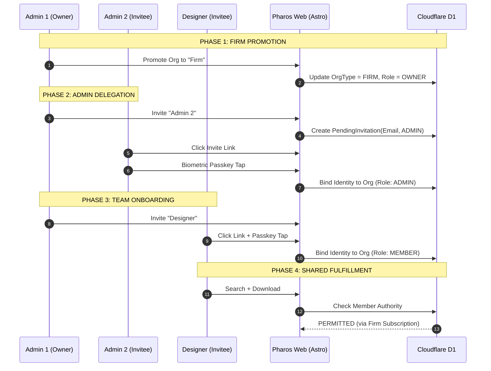

<!-- ========================================================================
 * Project: Pharos Kitchen Design (Project Prism)
 * Component: Documentation / Strategy
 * File: docs/adr/0061-firm-interaction-and-team-delegation.md
 * Author: Richard D. (https://github.com/iamrichardd)
 * License: FSL-1.1 (See LICENSE file for details)
 * Purpose: Codifying the multi-user organization workflow and role delegation.
 * Traceability: ADR-0056, ADR-0059, ADR-0060
 * Status: Proposed
 * ======================================================================== -->

# ADR 0061: Firm Interaction & Team Delegation

## Context
While Pharos Kitchen Design (Project Prism) begins with the "Solo Designer" (IKD), the platform must scale to support design firms. These firms require shared access to metadata forks, centralized billing, and redundant administrative authority. We need a workflow that allows an organization to grow from a "Sanctuary of One" to a "Fortress of many" without compromising biometric security or increasing the human-support burden of our one-person founder.

## Decision
We are implementing a **Delegated Team Workflow** based on the following principles:

1.  **Organization Promotion**:
    - A "Private Sanctuary" (Solo Org) can be promoted to a "Firm" or "Agency" Organization.
    - Promotion triggers the requirement for a **Multi-Seat Subscription (ADR-0059)**.

2.  **Role Hierarchy (Internal)**:
    - **OWNER**: Total control. Only the Owner can delete the Org or change the primary billing method.
    - **ADMIN**: Census control. Can invite/remove members, manage seat allocation, and update shared metadata.
    - **MEMBER (Designer)**: Fulfillment control. Can access shared forks and contribute to project metadata.

3.  **The Invitation Handshake**:
    - Adding users is strictly **Email-Invited & Passkey-Bound**.
    - Identity is bound to the invitee's device via Passkey (ADR-0050), eliminating password-reset toil.

4.  **Shared Authority (The Shared Sanctuary)**:
    - Metadata "Forks" created by any member of a Firm are stored in the **Organization Namespace**.
    - All members inherit read/write access to these shared forks.

### Interaction Topology

## Rationale
- **Zero-Toil Administration**: Passkeys remove the need for Admin-led password resets, protecting the project from support-call bloat.
- **Operational Redundancy**: Multi-Admin support ensures firm continuity without founder intervention.

## Impact
- **D1 Schema**: Addition of the `Invitations` table and `MembershipRole` ENUM.
- **UI**: Team Management dashboard implementation.

## Verification
- **Role Test**: Verify that a MEMBER cannot invite a new ADMIN.
- **Shared Access Test**: Verify that Designer B can see a fork created by Admin 1.
