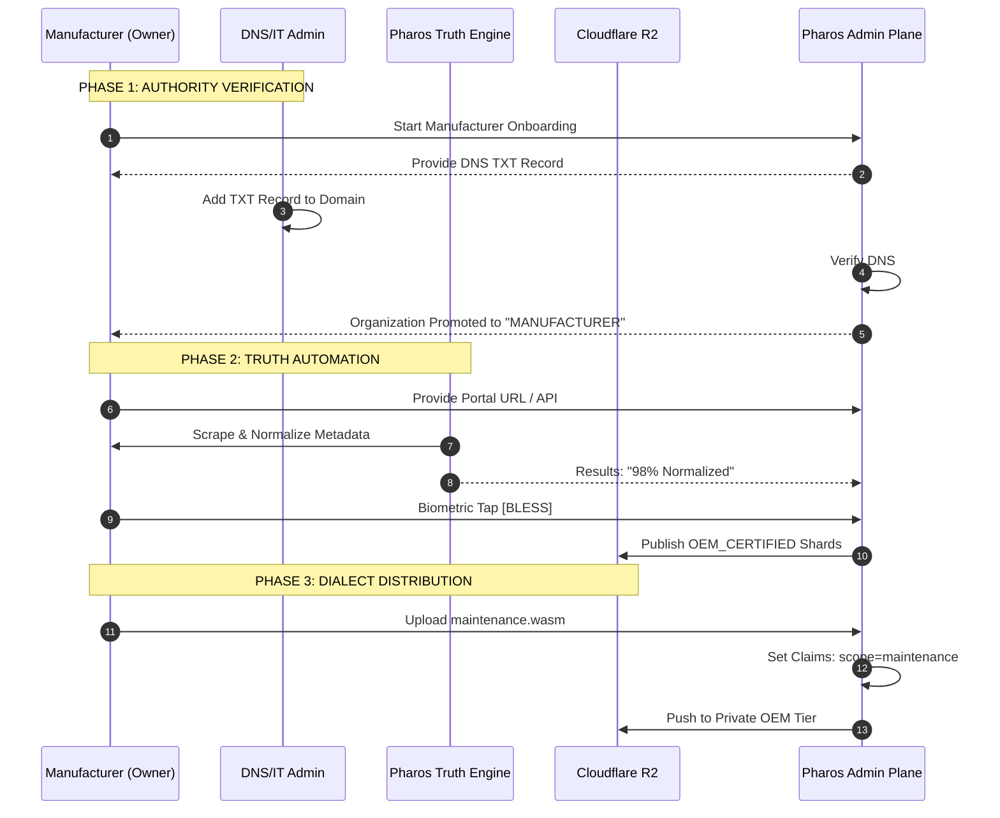

<!-- ========================================================================
 * Project: Pharos Kitchen Design (Project Prism)
 * Component: Documentation / Strategy
 * File: docs/adr/0063-manufacturer-distribution-and-certification-workflow.md
 * Author: Richard D. (https://github.com/iamrichardd)
 * License: FSL-1.1 (See LICENSE file for details)
 * Purpose: Codifying the Manufacturer onboarding, truth automation, and dialect distribution.
 * Traceability: ADR-0015, ADR-0052, ADR-0056, ADR-0059
 * Status: Proposed
 * ======================================================================== -->

# ADR 0063: Manufacturer Distribution & Certification Workflow

## Context
Legacy AEC platforms treat Manufacturers (OEMs) as passive content providers who must manually maintain their data in proprietary portals. Pharos Kitchen Design (Project Prism) shifts this paradigm by positioning the Manufacturer as the **Source of Authority**. We must provide a high-rigor workflow that automates the retrieval of "Truth" while ensuring that all certified data is cryptographically bound to a verified organizational identity.

## Decision
We are adopting a **Certification-First Manufacturer Workflow**:

1.  **The Authority Ladder (Onboarding Friction Reduction)**:
    - Manufacturers are no longer required to provide DNS verification on day one. Instead, we implement a three-tier escalation model:
    - **Tier 1: Domain-Bound Identity**: Proof of a corporate email (e.g., `@itwfoodequipment.com`) unlocks `STAFF` access to private dialects and "Provisional" registry updates.
    - **Tier 2: Peer Vouch (Manual)**: Manual verification by the Pharos Founder or PMA unlocks `DELEGATION` authority for Rep Agencies.
    - **Tier 3: DNS Domain Claim**: Proving ownership via DNS TXT records (ADR-0052) unlocks the **`OEM_CERTIFIED`** cryptographic badge and total brand sovereignty.

2.  **Truth Automation (The Proxy Sync)**:
    - Pharos implements a **"Truth Proxy"** model. Manufacturers provide a link to their public spec portal or API.
    - Every 30 days (ADR-0015), the Pharos Truth Engine automatically scrapes, normalizes, and compares this data against the existing registry.
    - **The Blessing Ritual**: Manufacturers receive a "Change Audit" report. They use their **Passkey** to "Bless" the changes, triggering an automated update to the registry shards.

3.  **Forensic Dialect Distribution**:
    - Manufacturers can host proprietary WASM dialects (e.g., maintenance tools, configuration wizards) within their private organizational namespace.
    - These artifacts are gated by **Organization-Based Scopes (ADR-0056)** and are only accessible to identities with the appropriate claims (Staff or Delegated Partners).

4.  **Rep Agency Delegation**:
    - Manufacturers use the **"Sovereign Handshake"** to grant specific scopes (e.g., `pricing.update`, `maintenance.execute`) to external Rep Agencies.
    - This delegation is biometric and revocable, eliminating the need for shared credentials.

### Interaction Topology

## Rationale
- **Zero-Toil Integrity**: Automation ensures metadata stays current without human data entry, addressing the primary pain point of legacy platforms.
- **Cryptographic Trust**: Using Passkey "Blessings" ensures that every certified shard has a clear, non-repudiable chain of custody.
- **Value Displacement**: We shift the manufacturer's spend from "Paying for Visibility" to "Paying for Distribution Power and Data Integrity."

## Impact
- **Engine**: The ETL pipeline must support manufacturer-specific scraping/normalization templates.
- **UI**: Implementation of the "Certification Dashboard" and "Change Audit" views.
- **D1 Schema**: Addition of `CertifiedShards` and `DelegatedScopes` tables.

## Verification
- **DNS Test**: Verify that an organization cannot be promoted to `MANUFACTURER` without a successful TXT record check.
- **Blessing Test**: Verify that a shard's `certified_by` metadata correctly reflects the Passkey thumbprint of the OEM Owner.
- **Sync Audit**: Verify that the 30-day "Pulse" correctly identifies and reports metadata drift from the manufacturer portal.
